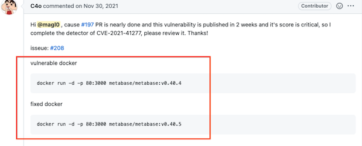
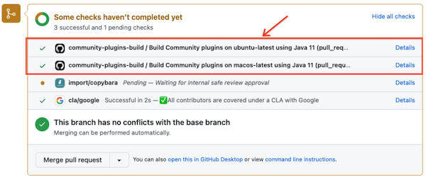

## Intended Audience

This document provides a set of guidelines on how Tsunami plugins are reviewed.
This is meant to facilitate the work of reviewers and contributors. If you're
considering submitting a PR for a new plugin, please read this guide.

## Goals and Philosophy

*   Tsunami supports a small manually curated set of vulnerabilities
*   Tsunami detects high severity, RCE-like vulnerabilities, which are often
    actively exploited in the wild
*   Tsunami generates scan results with high confidence and minimal
    false-positive rate
*   Tsunami detectors are easy to implement
*   Tsunami is easy to scale, executes fast and scans non-intrusively

## Review Process

### 1. General Review Prioritization

All plugin reviewed are prioritized by the following factors: 1. Whether a
plugin is urgent. In other words, if the vulnerability is very critical and is
being actively exploited. 2.
[Since Mar 2024](https://bughunters.google.com/blog/5691890239930368/tsunami-network-scanner-ai-security),
whether a plugin is labeled as `ai-bounty-prp`. 3. Date of submission (reversed)

### 2. Approve PRP Requests

The approval of Tsunami plugins is entirely at our discretion, and it is subject
to Tsunami's top level goals and philosophy. If the vulnerability is RCE like
and is detectable in Tsunami with high confidence, we would generally accept the
request.

Each PR is also evaluated based on the
[criteria below](#4-acknowledgements-and-evaluation). The overall quality and
reliability of the contribution will determine the reward (if applicable).

### 3. Review Github Pull Requests

#### Tsunami Plugin Review Process

##### Check Verification Docker Images

In the PR, first read through the descriptions and make sure that the
contributor has tested their plugin against the application version that is
vulnerable to the vulnerability, as well as against the application version with
the fixed code. This is to make sure that the plugin is working as intended.

We've explicitly asked the participant to use Docker images for this
verification so two Docker images should be supplied in the description of the
PR.

Older PRs might have inline instructions such as the following:



For recent PRs (including AI-related plugins), the config should be submitted to
https://github.com/google/security-testbeds. For newly opened PRs, please ask
contributors to submit their config to the `security-testbeds` repo.

> The Docker images should not contain private or proprietary content, such as
> licenses or activation keys. Instead, instructions on how to properly setup
> proprietary components should be provided. Additionally, consider providing
> Docker images with
> [multi-platform support](https://docs.docker.com/build/building/multi-platform/).

##### Verify Unit Tests Pass

At the bottom of the PR page, GitHub posted all pre-submit results as an info
card. A PR that passes all the test cases should look like:



Contributions that do not pass all checks will **not be accepted**.

##### Verify The Plugin Detection Is High Quality

-   [ ] Check the plugin against the submitted secure and vulnerable containers
    -   [ ] Verify the vulnerability's existence in the vulnerable container.
        This is meant to ensure the functional requirements.
    -   [ ] Verify that the detection is not false positive prone, not just
        doing version fingerprinting and status code checking. More reliable
        verification strategies like
        [templated string](https://github.com/google/tsunami-security-scanner/blob/96b5229b67a2a2dcc0368451d6b04b4feae66e6e/plugin/src/main/resources/com/google/tsunami/plugin/payload/payload_definitions.yaml#L43)
        and
        [out-of-bound callback](https://github.com/google/tsunami-security-scanner/blob/96b5229b67a2a2dcc0368451d6b04b4feae66e6e/plugin/src/main/resources/com/google/tsunami/plugin/payload/payload_definitions.yaml#L35)
        are provided as part of the payload generator framework.
    -   [ ] Verify that the detection works against the recent & popular
        versions of the target software.
    -   [ ] Verify that the detection heuristics are sufficiently optimized to
        ensure fast scans.
    -   [ ] Verify that the detector has good unit test coverage. Google's open
        source projects should be thoroughly tested and there is no exception
        for the Tsunami project. Unit testing makes sure the detector works
        using fake data.
    -   [ ] Verify there are actionable resolution steps provided in the finding
        with clear impacted versions (if version specific) and that the overall
        reported vulnerabilities contain high quality information:
        -   [ ] Check severity level
        -   [ ] Check that the title and description are clear
        -   [ ] The remediation is actionable and clear
        -   [ ] The related CVE field is filled if applicable
    -   [ ] Verify if the detector includes key details for quality assurance
        and debugging. For example, if the detector depends on presence of
        custom content like `/etc/passwd`, it would be very helpful to include
        the content in the
        [AddtionalDetails](https://github.com/google/tsunami-security-scanner-plugins/blob/master/google/detectors/directorytraversal/generic_path_traversal_detector/src/main/java/com/google/tsunami/plugins/detectors/directorytraversal/genericpathtraversaldetector/GenericPathTraversalDetector.java#L198)
        field of the vulnerability.
        -   [ ] At the end of the day, it is impossible to always foresee all
            the ways for false positive detections to happen. As a result,
            there's internal monitoring of the initial findings from each new
            detector. Sometimes if we are not sure if a given concern/assumption
            is valid, it is always a good idea to provide additional logs in the
            detector to help debugging during the initial triage process.
    -   [ ] Determine the ability of the plugin to work multi-platform (*if
        applicable*)
        -   [ ] Some of the vulnerable targets might be deployed on different
            architectures and / or operating systems. The ability for the plugin
            to work under all circumstances increases its detection
            capabilities. At the minimum, the plugin must work on Linux based
            operating systems.

##### Verify The Plugin Implementation Is High Quality

-   [ ] The code is clean and easy to follow
    *   The contributor has run
        [google-java-format](https://github.com/google/google-java-format).
    *   All the bootstrap comments are removed.
    *   No Java library imports are using wildcards character. They make code
        brittle and difficult to reason about, both for programmers and for
        tools.
-   [ ] Comments are provided to address some non-obvious nuances in the
    detection logic. Ideally, the comments should also contain details on the
    specific vulnerability that the plugin is attempting to detect.
-   [ ] Minimize new library dependency introduced, and check for duplication in
    existing libraries, for example, there should only be one Json parser.
-   [ ] Check the license of new dependencies, some of the forbidden licenses
    are:
    *   *AGPL (Affero GPL)*, *OSL*, *SSPL*, *Cryptographic Autonomy License
        (CAL)*, *CPAL*, *CPOL*, *European Union Public Licence (EUPL)*, *SISSL*,
        *Watcom-1.0*
    *   When in doubt, check with the Tsunami team

#### Tsunami Fingerprints Review Process

##### Verify The Correctness Of The Fingerprints

-   [ ] Tsunami scanner should be able to detect target versions of the
    application using the generated fingerprints. This is meant to ensure the
    functional requirements.

##### Verify The Quality of The "update.sh" Script

-   [ ] Check whether `update.sh` can be evoked locally with no runtime errors
    so that it can be used continuously in the future to generate new
    fingerprints for the newer version of the application.

### 4. Acknowledgements and Evaluation

#### Score the Contribution

-   [ ] The following metrics are used:
    *   Docker images are easy to use and comprehensive. This is required for
        vulnerability detector plugins only
    *   Plugin detection / fingerprinting quality
    *   Contribution implementation quality
    *   Complexity
    *   Responsiveness
    *   Overall quality, thoroughness of the work

#### Message To Both Contributors and the Tsunami Dev Team

-   [ ] Finalize the review by posting all comments using the PR review feature
    of Github. Clarify all remaining todos with bullet points to ease the
    contributor’s follow-up. Assuming that the expected changes have been
    implemented by the contributor, the PR can be accepted. A final message
    should provide an overall evaluation of the contribution:

```
Reviewer: <Name, Affiliation>

Plugin: <Context of the submission. What is the vulnerability type the plugin is verifying or specifics of the fingerprint mechanism>
Feedback: <General feedback on code quality, thoroughness of the work, reliability and accuracy of the contribution.
Use this space to highlight any potential gaps in the current detection/fingerprint logic>
Drawbacks: <Use this space to highlight potential concerns of likelihood of false positives to watch out for during the triage process,
any state changing operations & risks on the target service>
```
